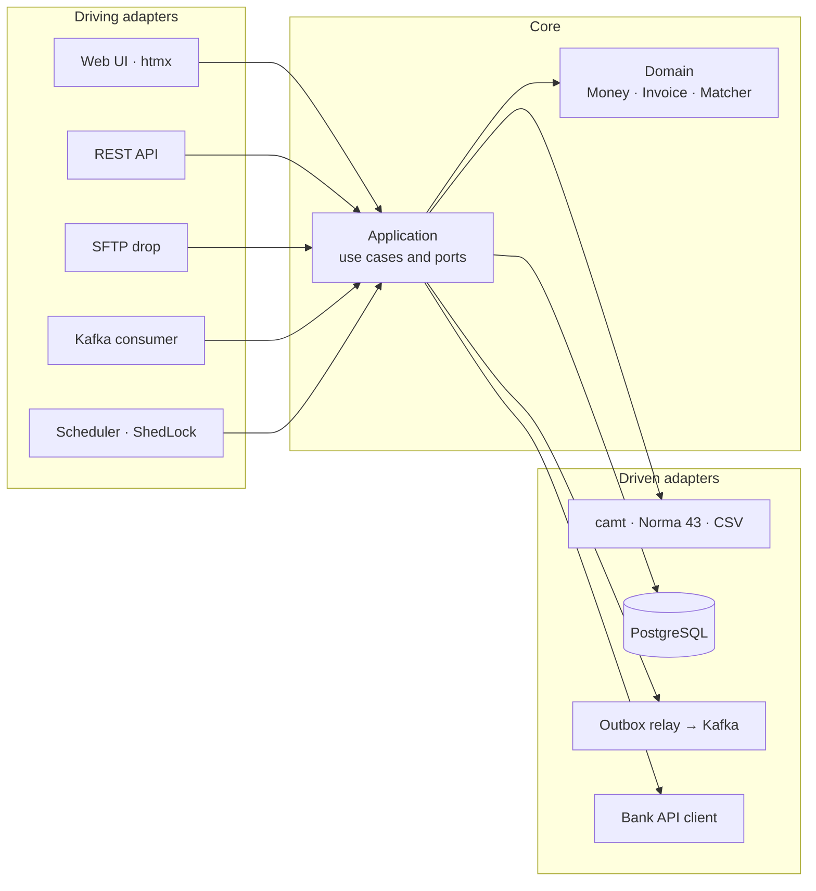

# Abgleich

[](https://github.com/bakaruu/Abgleich/actions/workflows/ci.yml)

**Abgleich reconciles invoices against bank statements from Switzerland and Spain: ISO 20022 XML and fixed-width
Norma 43. It auto-confirms only what is provably correct, explains every other proposal, and ships with a
catalogue of 45 known failure modes, each one pinned by a test.**


*Synthetic data only. [Screenshots](docs/images) · [Bug catalogue](docs/bug-catalogue.md) ·
[Architecture decisions](docs/adr) · [Deploying the demo](deploy/README.md)*

## What it does

- **Imports** camt.053 (versions 001.04 and 001.08), camt.054 notifications, Norma 43 and a documented CSV format.
  The format is detected from the content, balances must add up, and every payment is stored once even when files
  overlap or arrive twice.
- **Matches** payments with six rules, from an exact QR or creditor reference (R1) to one payment for several
  invoices (R6). Only R1 confirms on its own; everything else waits in a review queue with the rule, its
  confidence and a readable reason.
- **Reviews** proposals in the browser (Thymeleaf + htmx) or through a JSON API with optimistic locking: a stale
  or repeated decision never changes anything twice.
- **Integrates** like a real back office: statements arrive by upload, REST, an SFTP drop or a scheduled download
  from the bank API, and all four give the same result. Invoices arrive from the ERP as Kafka events;
  `InvoicePaid` goes back through a transactional outbox, so no event is lost or invented.
- **Reports** what was settled automatically, what waits for people, the unidentified money per currency and how
  often reviewers agree with each rule, on a Summary screen, through the API and as Prometheus metrics with a
  Grafana dashboard.

## Measured, not claimed

`./gradlew evaluateMatching` runs the matcher over 300 labelled Swiss and Spanish payments, including traps: the
same amount from another payer, look-alike company names, numbers that are not invoice numbers, debits carrying
references and real ties. The build fails on any wrong automatic confirmation.

| Rule | Signal | Confidence | Precision |
|------|--------|-----------:|----------:|
| R1 | QR or creditor reference and amount exact — the only rule that confirms alone | 1.00 | 80/80 |
| R2 | Same reference, different amount: partial, overpayment, bank charges, closed invoice | 0.90 | 50/50 |
| R3 | Reference one character away, exact amount | 0.85 | 20/20 |
| R4 | Invoice number in the remittance text, exact amount | 0.80 | 35/35 |
| R5 | Similar payer name close to the due date | 0.70 | 40/40 |
| R6 | Exact sum of two to five invoices of one debtor | 0.75 | 15/15 |

Wrong automatic confirmations: **0**. Proposals for payments without an invoice: **0**. The dataset is written
together with the rules, so these figures are an upper bound; real bank files will find cases it lacks, and each
one becomes a new labelled case ([ADR 0006](docs/adr/0006-matching-rules-and-review.md)).

## Edge cases handled

Every failure mode the design protects against has an ID and at least one test named after it. The build checks
that [the catalogue](docs/bug-catalogue.md) and the tests agree. A few of them:

| ID | What goes wrong | Protection |
|----|-----------------|------------|
| [B11](docs/bug-catalogue.md) | A truncated file is imported with wrong balances | Opening + credits − debits must equal closing, or nothing is stored |
| [B16](docs/bug-catalogue.md) | Two identical legitimate transfers are merged into one | Deduplication key with an ordinal for identical lines |
| [B21](docs/bug-catalogue.md) | Two simultaneous uploads of the same file both store it | Unique constraints decide, not a prior query |
| [B23](docs/bug-catalogue.md) | The event is published but the payment rolls back, or the reverse | Transactional outbox and relay |
| [B27](docs/bug-catalogue.md) | A wrong match is confirmed without a person | Only R1 confirms; precision measured over 300 cases |
| [B32](docs/bug-catalogue.md) | `<script>` in a transfer's remittance text runs in the reviewer's browser | Escaped output, strict CSP, browser test fails on console errors |
| [B43](docs/bug-catalogue.md) | A visitor uploads a real statement to the public demo | Banner, example buttons, every table purged nightly |

## Architecture



The domain knows nothing about Spring, PostgreSQL, Kafka, XML or HTML. Adapters never depend on each other, and
ArchUnit fails the build when they do. The database is the last line of defence: duplicate imports, unsigned
amounts, double confirmations and stale writes are refused by constraints and version checks, not only by code.

| Module | Responsibility |
|--------|----------------|
| `domain` | Pure Java model: `Money`, references, IBAN, statements, invoices, events, matching rules |
| `application` | Use cases and ports grouped by capability (statement, invoice, reconciliation, events, reporting, example); parser contract suite in test fixtures |
| `adapters/in-web` | Upload, review, invoice and summary screens (Thymeleaf + htmx) |
| `adapters/in-rest` | JSON API with Problem Details, `If-Match` and `Idempotency-Key` |
| `adapters/in-kafka` | `InvoiceCreated` consumer with a dead letter topic |
| `adapters/in-sftp` | SFTP drop: `.done` markers, `processed/` and `error/` folders |
| `adapters/in-scheduler` | Bank download, outbox relay and retention, demo reset; one instance at a time |
| `adapters/out-camt` | camt.053 and camt.054 with streaming StAX |
| `adapters/out-norma43` | Norma 43 fixed-width files |
| `adapters/out-csv` | Abgleich CSV |
| `adapters/out-postgres` | Spring JDBC and Flyway: constraints, outbox, inbox, summary queries |
| `adapters/out-kafka` | Publishes `InvoicePaid` and `InvoiceReopened` |
| `adapters/out-bank-api` | HTTP client of the bank statement API |
| `adapters/out-synthetic` | Deterministic example data and the labelled matching dataset |
| `bootstrap` | Spring Boot wiring, security, metrics, rate limit and end-to-end tests |
| `architecture-tests` | ArchUnit rules and the bug catalogue check |
| `mock-bank` | A stand-in bank statement API for tests and local runs |
| `smoke-tests` | Playwright browser journey and the README screenshots |

## Run locally

Requirements: JDK 21 and Docker.

```bash
./gradlew build              # compile and all tests (Testcontainers starts PostgreSQL and Kafka)
./gradlew evaluateMatching   # precision per matching rule over 300 labelled payments
docker compose up -d         # PostgreSQL, Kafka and an SFTP drop, all named abgleich-*-local-*
./gradlew :bootstrap:bootRun
```

Open <http://localhost:8080>, press **Load both**, then open **Review** and **Summary**. Metrics are at
<http://localhost:8080/actuator/prometheus>.

The SFTP drop and the bank API are off by default. To try them locally:

```bash
./gradlew :mock-bank:run     # bank API on port 8090, serving the example statements

ABGLEICH_SFTP_ENABLED=true ABGLEICH_SFTP_PASSWORD=sftp-local-only ABGLEICH_SFTP_ALLOW_UNKNOWN_KEYS=true \
  ABGLEICH_BANK_API_ENABLED=true ABGLEICH_BANK_API_TOKEN=mock-bank-local-only ./gradlew :bootstrap:bootRun
```

Upload a statement to `inbox/` on `sftp://bank@localhost:2222`, followed by an empty `<name>.done` file. Paid
invoices appear as events on the Kafka topic `abgleich.invoice-events`.

The whole public demo (Caddy, Prometheus, Grafana, nightly reset, rate limit) runs locally too: see
[deploy/README.md](deploy/README.md).

## Scope

Not included, on purpose: real bank connections (EBICS, PSD2), outgoing payments (pain.001, Norma 34), full
accounting or several companies, currency conversion, and user accounts. Decisions are recorded with the channel
that made them, not with a signed-in person; the public demo is open by design and resets every night.

## License

MIT — see [LICENSE](LICENSE).
